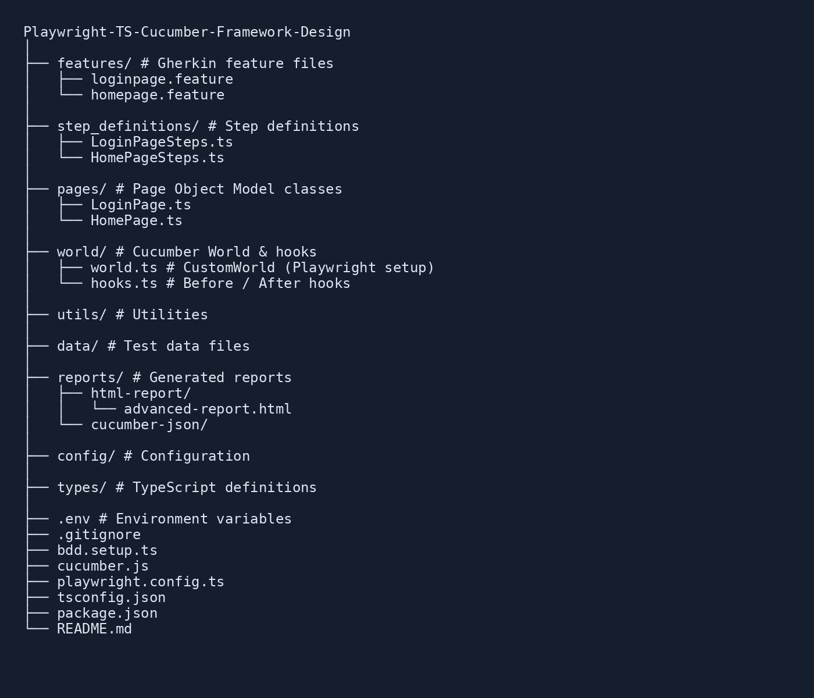

# Playwright + TypeScript + Cucumber (BDD) Automation Framework

A BDD-style test automation framework built using **Playwright**, **TypeScript**, and **Cucumber**.  
Designed with real-world best practices for **scalability, maintainability, and CI/CD readiness**.
---

## Tech Stack

- **Playwright** – Cross-browser automation
- **Cucumber (BDD)** – Gherkin feature files
- **TypeScript** – Type safety & maintainability
- **Node.js / npm**
- **Cucumber HTML Reporter** – Rich HTML reports with screenshots
- **GitHub Actions** – CI/CD
- **GitHub Pages** – Hosted test reports
---

## Project Structure

## Environment Configuration (.env)

This project uses a '.env' file to manage sensitive and environment-specific data.

## Create a '.env' file in the project root:

BASE_URL=https://example.com

SAUCE_USERNAME=standard_user

SAUCE_PASSWORD=secret_sauce

BROWSER=chromium | Firefox | Webkit (you can write any one value as per your choice)

HEADLESS=false

**Important**
- '.env' is added to '.gitignore'

- Each user / CI environment should provide its own '.env'

---

## Installation

### 1 Clone the repository
git clone https://github.com/renishpadariya/Playwright-TS-Cucumber-Framework-Design.git

cd Playwright-TS-Cucumber-Framework-Design

### 2 Install dependencies
npm install

### 3 Install Playwright browsers
npx playwright install

---

###  Execute Tests
Run all Cucumber scenarios:
npm test

Run tests in headed mode:
npm run test:headed

---

### Test Reports
## Standard HTML Report (CI & Local)
After execution, the HTML report is generated at:
reports/html-report/index.html

# This report includes:
Passed / Failed scenario count

Step-level execution status

Error messages

Screenshots for failed scenarios

## Advanced HTML Report
After running the tests, execute the following Node command:

npm run report:advanced

This command:

Reads the Cucumber JSON output

Generates a rich visual HTML report

Generated at:

reports/html-report/index.html

# Advanced report features:

Graphical execution summary

Scenario and step-level details

Failure screenshots

Clear visual representation for analysis and reporting

## Live Test Report (CI)

The latest execution report is automatically published via **GitHub Actions** and hosted using **GitHub Pages**.

**View Latest HTML Report:**  
https://renishpadariya.github.io/Playwright-TS-Cucumber-Framework-Design/

---
### Screenshots on Failure
Screenshots are automatically captured only for failed scenarios using:

Cucumber After hooks

Playwright page.screenshot()

They are visible in:

HTML report

CI artifacts

---
### Framework Design Highlights

BDD with Gherkin (business-readable tests)

Custom World for scenario-level isolation

One browser instance per scenario

Page Object Model (POM)

Environment-based execution

CI-ready with hosted reports

---

### CI/CD

GitHub Actions runs tests on every push & pull request

HTML reports are uploaded as artifacts

Reports are deployed automatically to GitHub Pages

